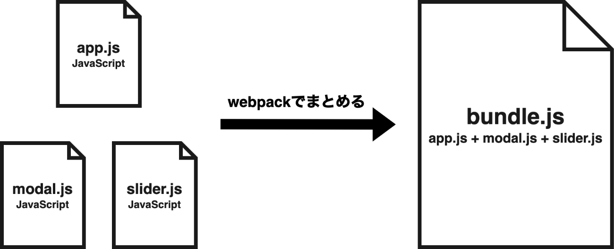
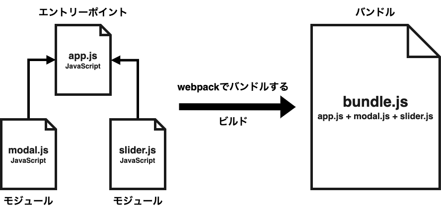

# 1.webpack とは

webpack はフロントエンド開発用のモジュールバンドラ。
「モジュールバンドラ」とは、複数のモジュールをまとめるツールのことであり、「モジュール」は JavaScript ファイルなどのことを指している。
そのため、簡潔に言ってしまえば、webpack は複数の JavaScript ファイルなどをまとめるツール。



## 2.webpack を利用する理由

### 2.1.様々なユースケースに応じたフロントエンドの開発環境を構築できるから

webpack には、「ローダー」と「プラグイン」という機能があり、それらを利用すれば以下のようにファイルをまとめる以外のことも可能。

- Babel で JavaScript をトランスパイル(古いブラウザでも使用できるように変換すること)
- Sass のコンパイル
- 画像の圧縮
- パフォーマンス最適化（ファイルの圧縮や分割など）

つまり、webpack を利用することで、様々なユースケースに応じたフロントエンドの開発環境を構築できる。

### 2.2.フロントエンド開発における様々なメリットが得られるから

webpack を利用することで、次のようなメリットを得られます。

- ファイルを分割する開発ができる
- 自分が作成したモジュールだけではなく、外部モジュール（npm などでインストールできるモジュールなど）も利用できる
- 依存関係を解決したファイルを出力できる
- 最適化したファイルを出力できる

#### ファイルを分割する開発ができる

webpack を利用することでファイルを分割する開発ができます。

今日のフロントエンド開発では、機能毎にファイルを分割して開発するのが一般的であり、そうすることで次のようなメリットが得られる。

- 可読性の向上
- 開発作業の分担やテストがし易くなる
- 名前空間を生成できる
- モジュールの再利用性を高められる

##### 可読性の向上

１つのファイルに複数の機能のコードや、数百数千行のコードが書いてあるよりも、ファイルが分割されていた方が読みやすく理解しやすくなる。

##### 開発作業の分担やテストがし易くなる

機能ごとにファイルを分割していれば、作業分担やテストがしやすい。

また、同じファイルを触らなくてすむので、Git などのバージョン管理システムを利用した時にコンフリクトが発生する可能性も減ります。

##### 名前空間を生成できる

webpack は分割したそれぞれのファイルに名前空間を生成するので、変数の競合やグローバル汚染を防げことができる。

要は、変数の名前が被ったり、予期せぬタイミングで変数の中身が上書きされてしまう心配をしなくて済む。

##### モジュールの再利用性ができる

汎用性の高いモジュールを開発すれば、それを再利用できます。

モジュールを再利用することで、複数のファイルに同じロジックをコピー&ペーストする必要がなくなる。

また、変更が発生した時も１つのモジュールを更新すれば良いので、モジュールの読み込み先を更新する必要がない

#### 依存関係を解決したファイルを出力できる

次のように複数のライブラリを読み込み、それに依存している app.js を読み込んでいる HTML ファイルがあるとします。

```html:index.html
<!DOCTYPE html>
<html>
  <head>
    <meta charset="utf-8" />
    <title>dependency</title>
  </head>
  <body>
    <script src="js/libs/libA.js"></script>
    <script src="js/libs/jquery.js"></script>
    <script src="js/libs/lodash.js"></script>
    <script src="js/libs/axios.js"></script>
    <!-- app.jsは↑のライブラリに依存しているため、それらを読み込んだ後に読み込む必要がある。 -->
    <script src="js/app.js"></script>
  </body>
</html>
```

上記のようなファイルは次のような問題点があります。

- スクリプトの読み込み順を変更したら動かなくなる。
- 依存が増えれば増えるほど依存関係がわかりづらくなる。
- どのファイルがどのファイルに依存しているのかを知っているのは、作業をした人間のみであり、別の作業者が依存関係をすぐに理解するのは困難。
- 依存関係がわかりづらいため、うかつにスクリプトの読み込み順を変更したり、不要なファイルを削除できない。

##### 開発メンバーの数が増えたり、アプリケーションの規模が大きくなればなるほど、上記の依存関係の問題は深刻になります。

一方で、webpack を利用すれば依存関係を自動で解決したファイルを出力してくれます。

そのため、次のように１つのスクリプトを読み込むだけでアプリケーションを動作させることが可能になります。

```html:index.html
<!DOCTYPE html>
<html>
  <head>
    <meta charset="utf-8" />
    <title>dependency resolved</title>
  </head>
  <body>
    <!-- 依存関係を解決してまとめられたファイルのため、これだけ読み込めば動作する -->
    <script src="js/bundle.js"></script>
  </body>
</html>
```

##### 最適化したファイルを出力できる

webpack を利用すれば、次のようなファイルを出力できるため、利用シーンによっては出力するファイルのサイズを大幅に減らせます。

- 圧縮したファイル
- 不要なコードを除去したファイル
- 複数のモジュールで利用している共通コードをまとめたファイル

## 2.3 webpack に関連する用語

「モジュール」のように、webpack を利用する上で、知っておいた方が良い用語はいくつかあります。

次の用語は、本書や公式ドキュメント、書籍、インターネット上でも用いられていることが多いため、覚えておきましょう。

- モジュール
- エントリーポイント
- バンドル
- バンドルする
- ビルド



### 2.3.1 モジュール

webpack でまとめるファイルのことです。

webpack では、次のようなファイルをまとめられます（他にもまとめられるファイルはあります）。

JavaScript
CSS
画像
そのため、JavaSctipt だけではなく、CSS や画像などもすべてモジュールです。

### 2.3.2 エントリーポイント

webpack がファイルをまとめる際、最初に解析を始めるファイルのことです。

webpack は、エントリーポイントからどのモジュールが利用されているのかなどの解析を始め、最終的にファイルを出力します。

### 2.3.3 バンドル

「まとめられたファイル」のことです。バンドルファイルとも言います。

そのため、次の言葉の意味は大体同じです。

「バンドルを生成する」=「まとめられたファイルを生成する」
「バンドルが大きい」=「まとめられたファイルのサイズが大きい」

### 2.3.4 バンドルする

「まとめる」のことです。

そのため、次の言葉の意味は大体同じです。

「モジュールをまとめる」=「モジュールをバンドルする」

### 2.3.5 ビルド

「バンドルを出力するまでの一連の処理」のことです。

そのため、次の言葉の意味は大体同じです。

「ビルドする（ビルドを実行する）」=「バンドルを出力するまでの一連の処理を実行する」
「ビルドが遅い」=「バンドルを出力するまでの一連の処理が遅い」
