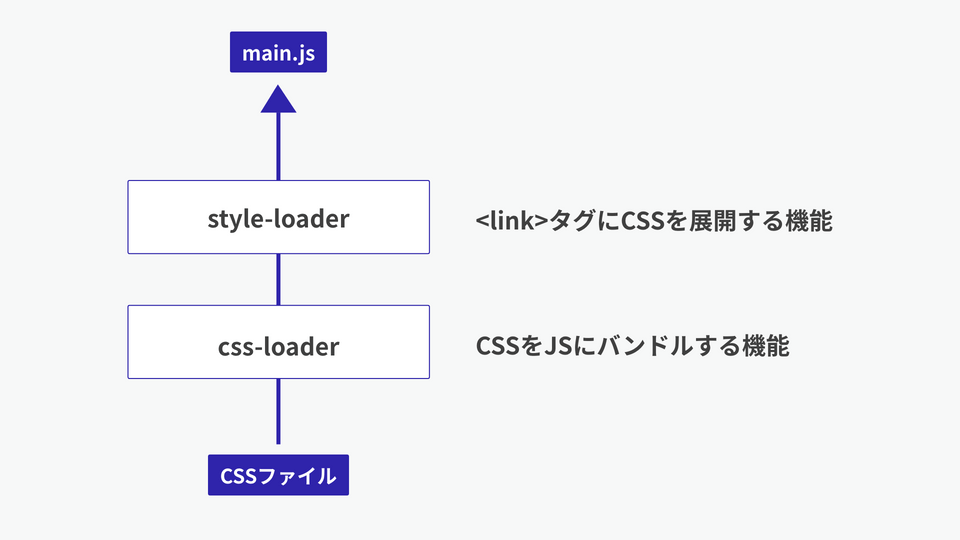
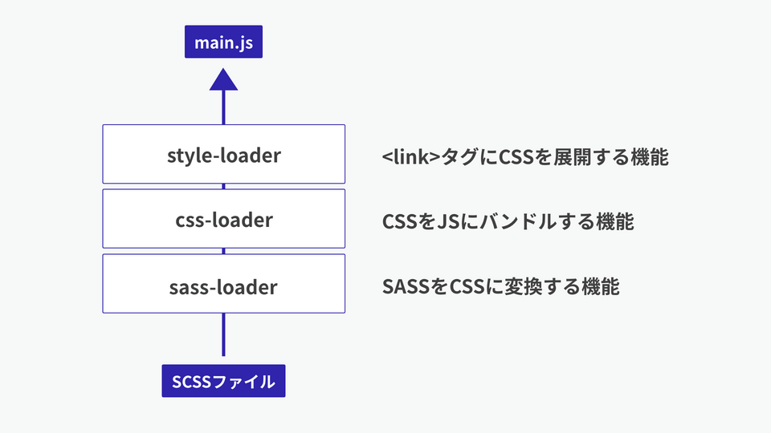

# webpack で css,scss を使用する方法

参考サイト：https://ics.media/entry/17376/

## css 手順

1. CSS の読み込みに必要なローダーは、Style Loader と CSS Loader なので、この 2 つのプラグインをプロジェクトフォルダーにインストールします。コマンドラインで次のコマンドを入力ください。

```
npm i -D webpack webpack-cli style-loader css-loader
```

2. webpack.config に設定を追加

続いて、webpack.config.js ファイルに次の設定を追記します。本来は細かいオプションを設定できますが、最低限の内容としては次のコードとなります。CSS のバンドルには「style-loader」と「css-loader」の 2 種類が必要だと覚えてください。

```js
module.exports = {
  // モード値を production に設定すると最適化された状態で、
  // development に設定するとソースマップ有効でJSファイルが出力される
  mode: "production",
  module: {
    rules: [
      {
        test: /\.css/,
        use: [
          "style-loader",
          {
            loader: "css-loader",
            options: { url: false },
          },
        ],
      },
    ],
  },
};
```

拡張子が.css のファイルに対して、use 配列で指定した Loader が後ろから順番に適用されます。処理を図示すると次のような流れになります。



style-loader: 動的に style タグが作られ、head 要素内に差し込まれることで css が適用されます
css-loader: css 内の url()メソッドや@import 文を JavaScript の require()メソッドに変換。webpack が画像も依存解決します

コンテンツ側のソースコード
src フォルダー内に index.js と style.css の 2 つのファイルを格納します。index.js ファイルには import 文を用いて、CSS ファイルを読み込むように記述します。

```js
// import 文を使ってstyle.cssファイルを読み込む。
import "./style.css";
```

設定は完了したので、webpack を実行してビルドを行う

## scss 手順

Sass の読み込みに必要なローダーは、sass-loader です。また、Sass Loader は Sass のコンパイル用モジュール sass に依存しているので、あわせてインストールします。コマンドラインで次のコマンドを入力します。

1. モジュールのインストール

```
npm i -D webpack webpack-cli sass-loader sass style-loader css-loader
```

2. webpack.config.js ファイルの設定

```js
// [定数] webpack の出力オプションを指定します
// 'production' か 'development' を指定
const MODE = "development";

// ソースマップの利用有無(productionのときはソースマップを利用しない)
const enabledSourceMap = MODE === "development";

module.exports = {
  // モード値を production に設定すると最適化された状態で、
  // development に設定するとソースマップ有効でJSファイルが出力される
  mode: MODE,

  module: {
    rules: [
      // Sassファイルの読み込みとコンパイル
      {
        test: /\.scss/, // 対象となるファイルの拡張子
        use: [
          // linkタグに出力する機能
          "style-loader",
          // CSSをバンドルするための機能
          {
            loader: "css-loader",
            options: {
              // オプションでCSS内のurl()メソッドの取り込みを禁止する
              url: false,
              // ソースマップの利用有無
              sourceMap: enabledSourceMap,

              // 0 => no loaders (default);
              // 1 => postcss-loader;
              // 2 => postcss-loader, sass-loader
              importLoaders: 2,
            },
          },
          {
            loader: "sass-loader",
            options: {
              // ソースマップの利用有無
              sourceMap: enabledSourceMap,
            },
          },
        ],
      },
    ],
  },
};
```

拡張子が.scss のファイルに対して、use 配列で指定した Loader が後ろから順番に適用されます。処理を図示すると次のような流れになります。



コンテンツ側のソースコード
ローダーを用いて Sass を読み込むには、エントリーポイント内で import 文を用いて次のように記述します。src フォルダー内に index.js ファイルと style.css ファイルを格納しているとして解説します。

```js
// import文を使ってSassファイルを読み込む。
import "./style.scss";
```

設定は完了したので、webpack を使用してビルドを行う
